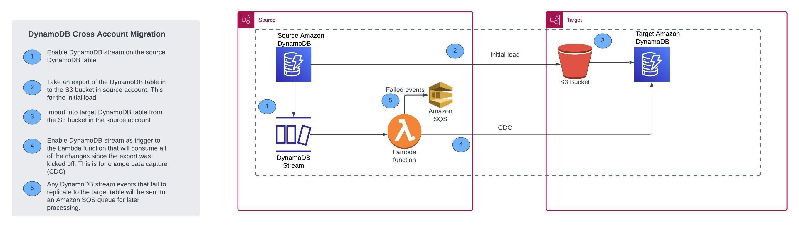
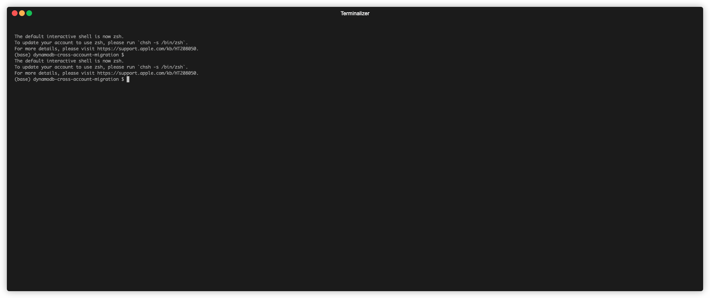

# Cross-account migration for Amazon DynamoDB

## Description
This project aims to facilitate zero-downtime cross-account migration of Amazon DynamoDB tables. It incorporates the initial data load feature using Amazon DynamoDB's export to Amazon S3 and import from Amazon S3 capabilities, followed by Change Data Capture (CDC) using DynamoDB Streams and AWS Lambda functions.




## Requirements
- Require Boto3 version 1.34.99.
- Two AWS accounts (source and target) with permissions to create AWS IAM roles, AWS Lambda functions, Amazon DynamoDB Streams, Amazon SQS queue, and access to Amazon S3.
- AWS CLI (Command Line Interface) configured with appropriate credentials.
- Enable Point-in-Time Recovery (PITR) on the source Amazon DynamoDB table.


## Getting Started
1. Clone the git repository.
2. Create a zip file for AWS Lambda function:
```bash
cd src
pip install -r requirements.txt --target ./lambda-code
cp dynamodb-cross-account-cdc-lambda-function.py lambda-code
cd lambda-code
zip -r function.zip .
cd ..
mv lambda-code/function.zip .
rm -r lambda-code
```
3. Create an Amazon S3 bucket named 'lambda-code-bucket-SourceAWSAccountID' in the source AWS account.
4. Upload the 'src/function.zip' file to the Amazon S3 bucket named 'lambda-code-bucket-SourceAWSAccountID' created in step 3.


5. Deploy the CloudFormation template source_cfn_template.yaml in the source AWS account and target_cfn_template.yaml in the target AWS account to create required resources such as AWS IAM Roles, AWS Lambda function, Amazon S3 Bucket, and Amazon SQS queue.


## Usage
To initiate the migration, execute the src/dynamodb-initial-load-and-cdc-setup.py script in your terminal with the user or role you specified in the CloudFormation template.
```bash
python dynamodb-initial-load-and-cdc-setup.py \
--source-region <source-region> \
--source-table-name <source-table-name> \
--source-account-id <source-account-id> \
--target-region <target-region> \
--target-table-name <target-table-name> \
--target-account-id <target-account-id> \
--target-s3-bucket-name <target-s3-bucket-name> \
--target-role-name <target-role-name> \
--target-table-read-capacity <target-table-read-capacity> \
--target-table-write-capacity <target-table-write-capacity> \
--cdc-lambda-function-name <cdc-lambda-function-name> \
--lambda-event-source-batch-size <lambda-event-source-batch-size>
```




### Argument Details
* `--source-region` (required): Region of the source DynamoDB table
* `--source-table-name` (required): Source DynamoDB table name
* `--source-account-id` (required): Source AWS account ID
* `--target-region` (required): Region of the target DynamoDB table
* `--target-table-name` (required): Target DynamoDB table name
* `--target-account-id` (required): Target AWS account ID
* `--target-s3-bucket-name`: Target S3 bucket name (default: dynamodb-export-to-s3-target-region-target-account-id)
* `--target-role-name` (default: "cross_account_assume_role"): Target role name
* `--target-table-read-capacity` (required): Read capacity of the target DynamoDB table
* `--target-table-write-capacity` (required): Write capacity of the target DynamoDB table
* `--cdc-lambda-function-name` (default: "dynamodb-cross-account-cdc-lambda-function"): Name of the CDC Lambda function
* `--lambda-event-source-batch-size` (default: 100): The maximum number of records in each batch that Lambda pulls from DynamoDB stream

Above script will perform the initial load and then set up the CDC for the ongoing replication.

## Best practices
1. If your source table is using on-demand capacity mode then look at the read and write consumptions of the source table and use 2X of the peak consumption for 'target_table_read_capacity' and 'target_table_write_capacity' arguments for dynamodb-initial-load-and-cdc-setup.py. Once the script is completed then change the capacity setting of your target table to on-demand. This will [pre-warm](https://docs.aws.amazon.com/amazondynamodb/latest/developerguide/HowItWorks.ReadWriteCapacityMode.html#HowItWorks.PreWarming) your target table.
2. Monitor your AWS SQS queue for any failed items that did not replicate to the target table.
3. Monitor CDC AWS Lambda metrics for any issues with the replication. You can monitor the IteratorAge metric for replication lag. Monitor Errors and Throttles metric for any errors in CDC or throttling with AWS Lambda function.
4. Before your application cutover to the target table, you can let the CDC AWS lambda function run for a few days to validate data consistency between the source and target table. For every read operation to the source table in your application, you can perform an asynchronous read to the target table and validate if it matches with the source table. Please note that there would be a replication lag between the source and target tables if you read an item immediately after it's been written. You may have to implement retries if the source table item doesn't match with the target table item because of the replication lag.
5. Once your application is cutover to the target table, disable Amazon DynamoDB streams on the source table and delete the event source mapping of the CDC AWS Lambda function.


## Security
1. Prior to initiating migration, verify that the data being migrated does not fall under any regulatory compliance requirements such as PCI, HIPAA, GDPR. If regulated data will be handled during migration, a thorough threat model must be conducted to identify and mitigate potential security risks.
2. Exercise caution when moving data from production to non-production accounts to mitigate security risks.

See [CONTRIBUTING](CONTRIBUTING.md) for more information.

## License
This project is licensed under the MIT License. See the [LICENSE](LICENSE) file.
